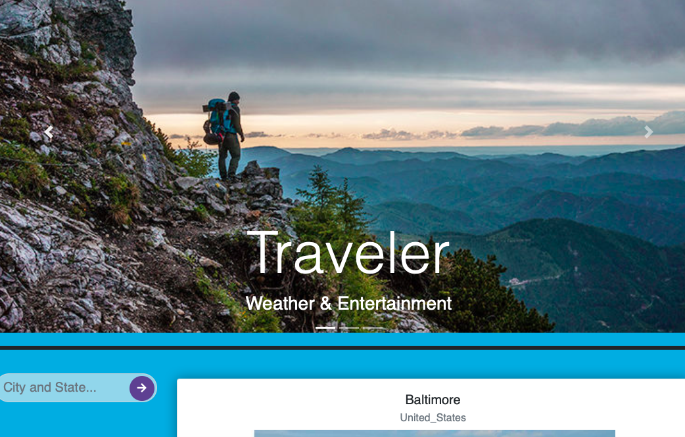

## Traveler

https://nrlong.github.io/travelerapp/




## Project description

Using this application travels could find out the main information about the city, the current weather, events, and location to stop by.

## Framework

Bootstrap

## API to use

1. Google maps
2. OpenWeather 
3. Eventbrite


## User Story

```
AS A traveler
I WANT to see the weather, the events and hotels
SO THAT I can plan a trip accordingly
```

## Acceptance Criteria

When you search a city in the search bar by pressing 'enter' on your keyboard or clicking 'search arrow' you get the weather, local history, and events happening in that city. 

## Contributing


[](https://www.github.com/Antidetka) | 
[](mailto:musovirova@yahoo.com)


[](https://www.github.com/RobWongus) | 
[](mailto:rob_wo@yahoo.com)

## Questions


[](https://www.github.com/nrlong) | 
[](mailto:nrlong13@gmail.com)